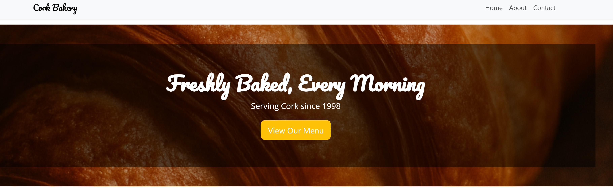
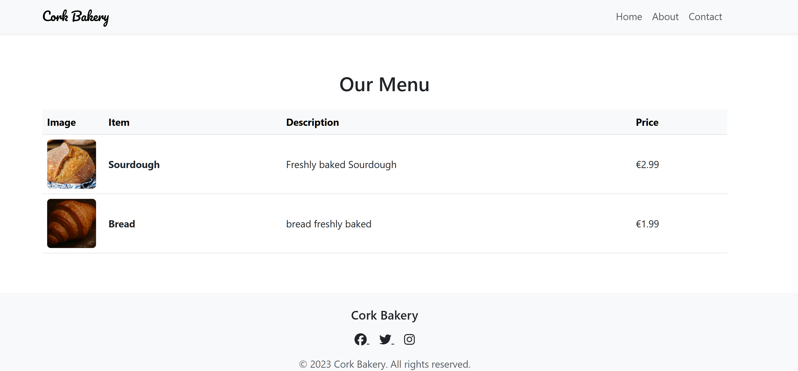
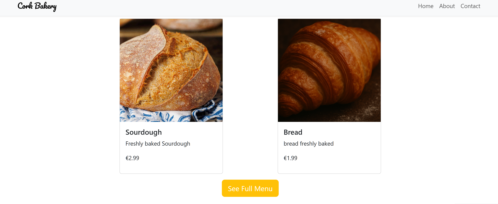
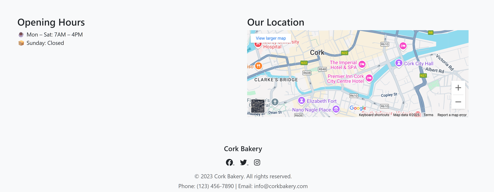
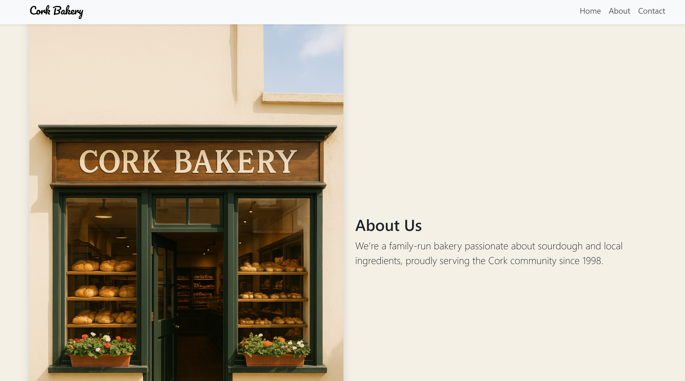
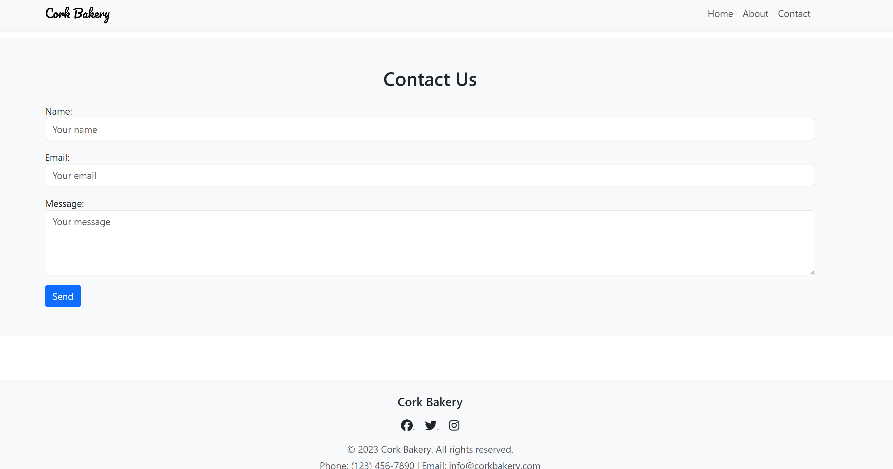

# Bakery Menu Web Application

A simple and elegant Django-based web application to showcase a bakery’s menu. This project allows easy management of bakery products and menu items through the Django admin interface and displays them beautifully on the website using Bootstrap.

---

## Features

- **Dynamic Menu Management**: Add, edit, and manage bakery products with images, descriptions, and prices via Django Admin.
- **Menu Items Control**: Decide which products appear on the menu and customize their order and availability.
- **Responsive Frontend**: Clean and responsive design powered by Bootstrap for great user experience on all devices.
- **Multiple Views**:
  - **Home Page Preview**: Highlights select menu items on the homepage.
  - **Full Menu Page**: Displays the complete menu in a user-friendly table layout.
- **Image Upload**: Upload product images to visually enhance the menu.

---
 
## Screenshots

### Homepage Preview


### Full Menu Page


### Highlight


### Hour & Map


### About


### Contact



---

## Technologies Used

- **Backend**: Django (Python web framework)
- **Frontend**: Bootstrap 5 (responsive CSS framework)
- **Database**: SQLite (default Django database)
- **Templating**: Django Templating Language (DTL)
- **Image Handling**: Django's built-in `ImageField` and media settings

---

## How It Works

1. **Admin Interface**: Use Django Admin to create `Product` entries with name, description, price, and image.
2. **Menu Control**: Create `MenuItem` entries linking to `Product` to control menu availability and order.
3. **Frontend Display**:
   - Homepage shows a preview selection of available menu items.
   - Menu page lists all available items in a Bootstrap-styled table with images, descriptions, and prices.
4. **URL Routing**: Separate views for home and menu pages serve respective templates with the menu data.

---

## Getting Started

1. Clone this repo.
2. Set up a virtual environment and install dependencies:
   ```bash
   pip install django
3. Run migrations:
   ```bash
   python manage.py migrate
   ```

4. Create a superuser to access the admin panel:
   ```bash
   python manage.py createsuperuser
   ```

5. Run the development server:
   ```bash
   python manage.py runserver
   ```

6. Visit [http://localhost:8000/admin/](http://localhost:8000/admin/) to add products and menu items.

View the homepage and menu pages at / and /menu/ respectively.

